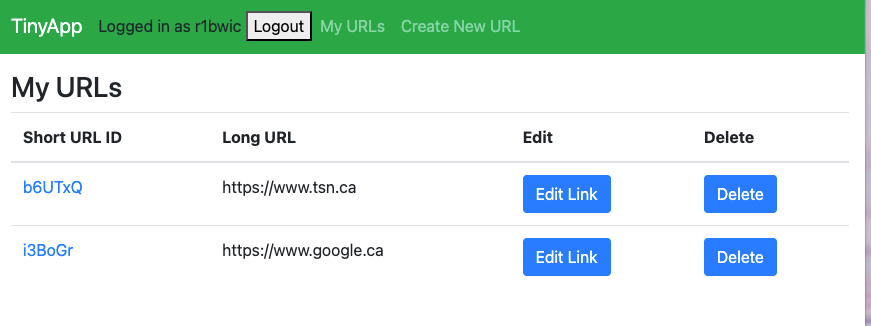

# TinyURL Clone 🧷

A simple URL-shortening web application built using Node.js, Express, EJS, and cookie-based sessions. Users can register and log in, create short URLs, view, edit, and delete only their own links.



---

## 📦 Tech Stack

- **Node.js** & **Express** — Server framework  
- **EJS** — Templating engine  
- **cookie-session** — Session-based authentication  
- **bcryptjs** — Secure password hashing  


---

## ⚙️ Features

- **User Registration & Authentication**  
  - Users can sign up with email and password  
  - Passwords are hashed using bcrypt  
  - Logged-in state maintained via `cookie-session`

- **URL Management**  
  - Create short URLs that redirect to long URLs  
  - View, edit, and delete URLs (only those you created)  
  - Each link is associated with its creator (via `userID`)

- **Authorization & Error Handling**  
  - Middleware validates existence of URLs (`404`)  
  - Ensures only logged-in users access protected routes (`401`)  
  - Prevents unauthorized access to others’ URLs (`403`)

---

## 🔧 Setup & Installation

1. Clone this repo and navigate into it:
   ```bash
   git clone https://github.com/pachondaniela/tinyapp
   cd tinyapp
2. Use npm install to install all the packages:
    The project uses the following key dependencies:

    * bcryptjs – for password hashing
    * cookie-session – to manage user sessions
    * ejs – as the templating engine
    * express – for building the server

Start the application using: npm start
